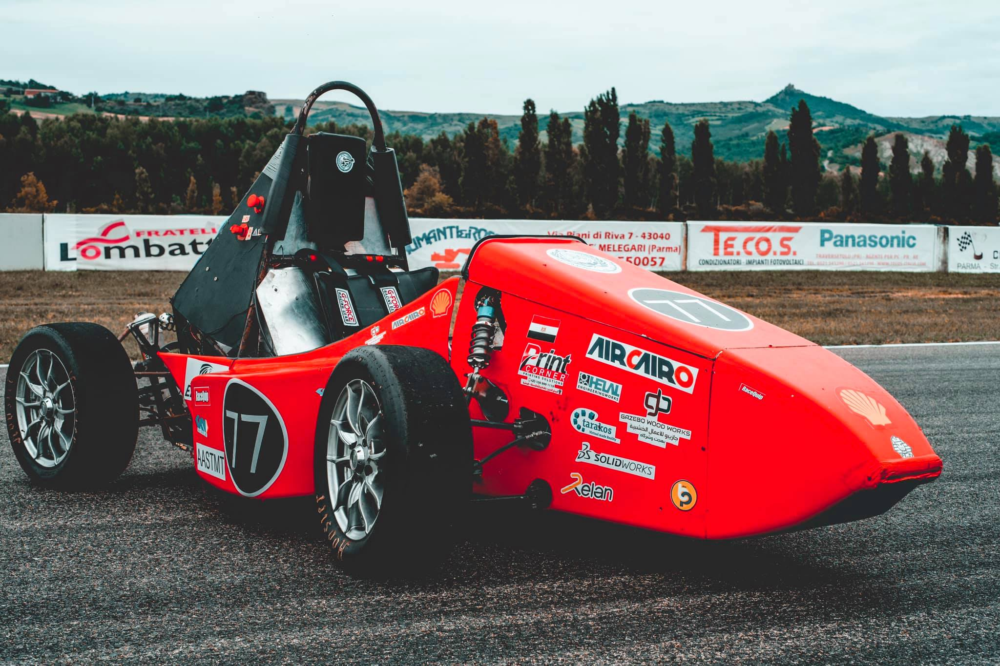
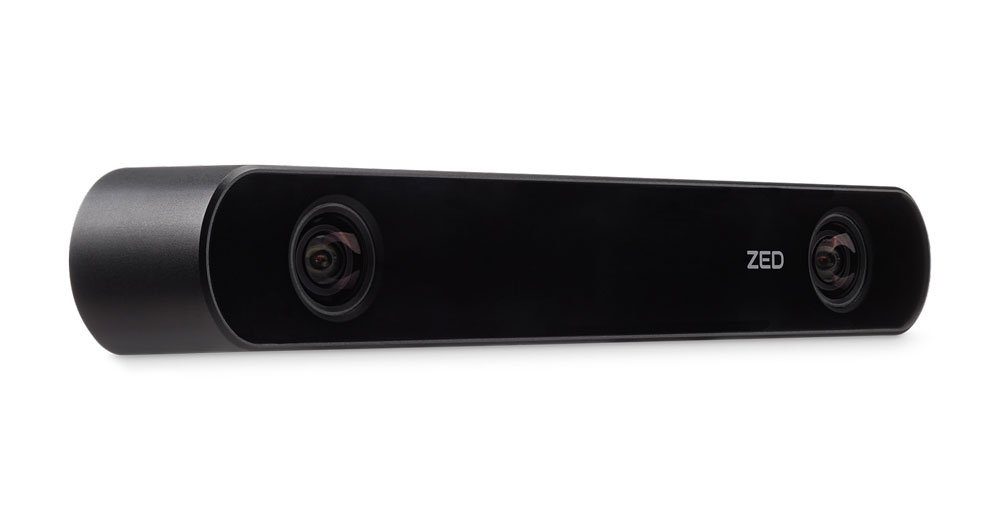

<!-- PROJECT LOGO -->
<br />
<p align="center">
  <a href="https://github.com/Fayoumi98/hardware_config_zed2/blob/master/README.md">
    
  </a>
  <a href="https://github.com/Fayoumi98/hardware_config_zed2/blob/master/README.md">
    
  </a>

  <h3 align="center">Arab Academy Motors</h3>

  <p align="center">
    Hardware Configuration (Zed2)
    <br />
    <br />
    <br />
    <a href="https://github.com/Fayoumi98/hardware_config_zed2/issues">Report issue</a>
  </p>
</p>


<!-- TABLE OF CONTENTS -->
<details open="open">
  <summary>Table of Contents</summary>
  <ol>
    <li>
      <a href="#About AAM-Driverless">About AAM-Driverless</a>
      <ul>
    <li>
      <a href="#getting-started">Getting Started</a>
      <ul>
        <li><a href="#prerequisites">Prerequisites</a></li>
        <li><a href="#installation">Installation</a></li>
      </ul>
    </li>
    <li><a href="#usage">Usage</a></li>
    <li><a href="#contributing">Contributing</a></li>
    <li><a href="#license">License</a></li>
    <li><a href="#contact">Contact</a></li>
  </ol>
</details>


<!-- ABOUT THE PROJECT -->
## About AAM-Driverless

our team installs an autonomous function in the race vehicle, a simple,computational efficient yet robust pipeline was our target. State-of-the-art algorithms were adopted in perception, state estimation, path planning, and control.


<!-- GETTING STARTED -->
## Getting Started

This simulation uses gazebo and ROS (robot operating system) 

### Prerequisites

This is an example of how to list things you need to use the software and how to install them.
* ubuntu 18.04
* ROS melodic
* CUDA

### Installation

1. Zed SDK Installation Steps: [https://www.stereolabs.com/developers/release/](https://www.stereolabs.com/developers/release/)
  ```sh
chmod +x file.run
  ```
  ```sh
./file.run
  ```
2. Zed ROS examples Installation Steps: [https://github.com/stereolabs/zed-ros-examples](https://github.com/stereolabs/zed-ros-examples)
3. Zed ROS wrapper Installation Steps: [https://github.com/stereolabs/zed-ros-wrapper](https://github.com/stereolabs/zed-ros-wrapper)

<!-- USAGE EXAMPLES -->
## Usage

1. Run Zed2 camera node
```sh
source devel/setup.bash
```
```sh
roslaunch zed_wrapper zed2.launch
```


<!-- LICENSE -->
## License

This workspace is a private property of AAM team please don't share it online 


<!-- CONTACT -->
## Contact

Omar El-Fayoumi - omarselfayoumi@gmail.com
